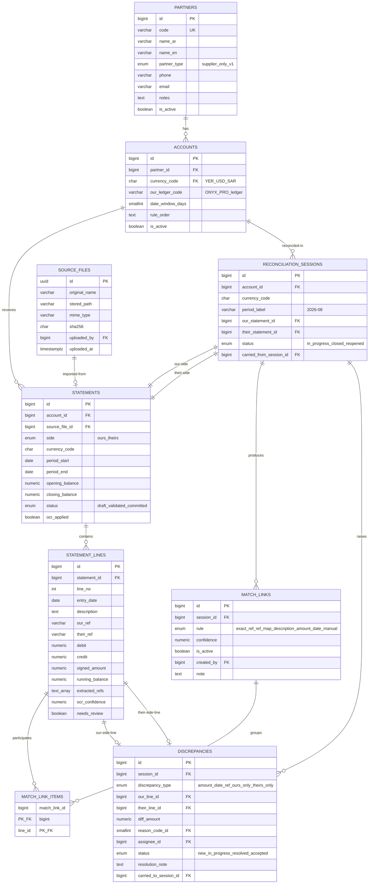
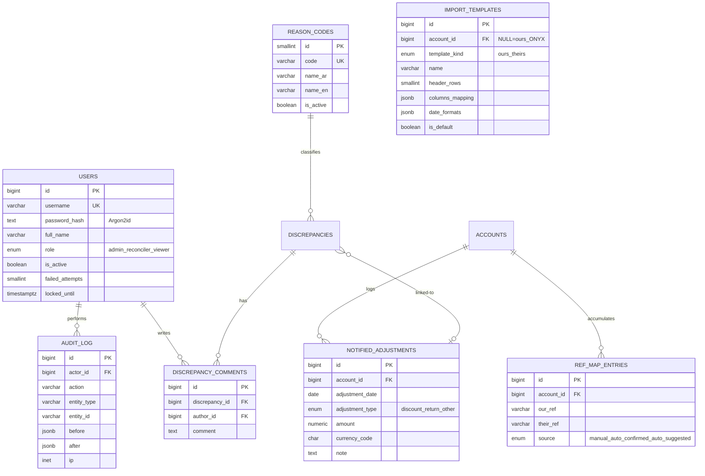

# 🏗️ وثيقة المعمارية التقنية — Stage 2: Architecture
## نظام مطابقة كشوفات الحسابات (Statement Reconciliation System)

> **الحالة:** ✅ **معتمدة من مالك المشروع (2026-09-06)** — الحزمة التقنية أُقرّت رسمياً؛ التنفيذ يبدأ بأمر المالك فقط
> **التاريخ:** 2026-09-06
> **المصدر:** وثيقة التحليل المعتمدة `stage-1-analysis.md`
> **تنويه:** هذه الوثيقة **تصميم** (مخططات ومواصفات) وليست كوداً تنفيذياً. سكربتات المخطط أدناه مواصفة مرجعية للمصمم، ولا يُبنى منها شيء قبل موافقتك.

---

## 0. القرار الأكبر: لماذا هذه الحزمة التقنية؟ (بلغة بسيطة)

اخترنا حزمة مجانية 100% وتعمل **داخل شركتك بلا إنترنت**، ويمكن تشغيلها على خادم واحد:

| المكوّن | الاختيار | لماذا؟ بلغة بسيطة |
|---|---|---|
| **قاعدة البيانات** | PostgreSQL 16 | خزان بيانات مجاني وقوي جداً، يحفظ المبالغ المالية **بدون أي خطأ تقريب** (شرط Q11)، ويعمل على Windows وLinux، ونسخه الاحتياطي ملف واحد |
| **الخادم الخلفي (Backend)** | .NET 8 — ASP.NET Core (C#) | "محرّك" البرنامج: معروف بصلاحيته في الأنظمة المالية، يعمل كخدمة ويندوز عادية (أي مسؤول شبكات يشغّلها)، ومكتباته تقرأ Excel وPDF وتولّد تقارير PDF عربية بممتاز |
| **الواجهة (Frontend)** | React 18 + TypeScript + Vite + Ant Design 5 | الشاشات التي يستخدمها المحاسب: Ant Design تدعم العربية من اليمين لليسار (RTL) وجداولها مصممة أصلاً للبيانات المالية الكثيفة |
| **قراءة PDF الرقمي** | PdfPig (استخراج نص) | مفتوح المصدر، يستخرج النصوص من PDF غير الممسوح بدقة |
| **قراءة الممسوح ضوئياً (OCR)** | Tesseract 5 محلي (عربي + إنجليزي) | يعمل على جهازك **بلا إنترنت إطلاقاً** (شرط Q16) — ومخرجاته تمر إلزامياً على شاشة تدقيق بشري |
| **توليد التقارير** | QuestPDF (PDF عربي RTL) + ClosedXML (Excel) | تقرير رسمي أنيق للطباعة والإرسال للمورد + ملف Excel للداخل |
| **النشر** | **خادم Windows داخل الشركة** (قرار معتمد D8): الخدمة كـ Windows Service خلف IIS + PostgreSQL محلي | لا سحابة، لا اشتراكات، لا بيانات خارج الشبكة |

**⚠️ بديلان ناقشتهما وفضّلنا عدمهما (للشفافية):**
- *Blazor بدل React* (لغة واحدة C#): أبسط للنشر لكن جداول المطابقة التفاعلية المعقدة (سحب/ربط/مقارنة جنباً لجنب) نضجها أكبر في React.
- *MySQL بدل PostgreSQL*: كلاهما جيد؛ PostgreSQL أصرم في القيود المالية والدوال المتقدمة وكلاهما مجاني.

---

## 1. المعمارية العامة (High-Level Architecture)

### 1.1 المبدأ: طبقات مفصولة (Clean Architecture)

```
┌─────────────────────────────────────────────────────────────────┐
│  المتصفح (أجهزة المحاسبين على الشبكة الداخلية)                   │
│  React + TypeScript + Ant Design (عربية RTL)                     │
└──────────────────────────┬──────────────────────────────────────┘
                           │ HTTPS/HTTP — REST JSON (شبكة LAN فقط)
┌──────────────────────────▼──────────────────────────────────────┐
│  خادم الشركة (جهاز واحد يشغّل كل شيء)                             │
│                                                                  │
│  ┌────────────────────────────────────────────────────────┐    │
│  │  طبقة الواجهة البرمجية API (Controllers/Endpoints)      │    │
│  │  مصادقة + صلاحيات + تحقق مدخلات + معالجة أخطاء موحدة    │    │
│  └───────────────────────────┬────────────────────────────┘    │
│                              │                                   │
│  ┌───────────────────────────▼────────────────────────────┐    │
│  │  طبقة التطبيق (Application) — حالات الاستخدام            │    │
│  │  منطق سير العمل: جلسات، فروق، تقارير، قواعد موافقة       │    │
│  └──────────────┬───────────────────────────┬─────────────┘    │
│                 │                           │                   │
│  ┌──────────────▼───────────────┐  ┌────────▼────────────────┐  │
│  │  طبقة المجال (Domain)         │  │  طبقة البنية (Infra)     │  │
│  │  ❤️ محرك المطابقة             │  │  • قراءة Excel/CSV/PDF   │  │
│  │  قواعد المطابقة والتوازن      │  │  • OCR محلي (Tesseract)  │  │
│  │  كيانات: كشف/بند/فرق/ربط     │  │  • PostgreSQL (EF Core)  │  │
│  │  قابلة للاختبار الآلي 100%    │  │  • ملفات + تقارير PDF    │  │
│  └──────────────────────────────┘  └─────────────────────────┘  │
└──────────────────────────────────────────────────────────────────┘
```

**لماذا هذا الشكل؟ (بساطة):**
- **طبقة المجال منفصلة تماماً:** محرك المطابقة لا يعرف شيئاً عن Excel أو قواعد البيانات — يتعامل مع "بنود وأرقام". هذا يجعله **قابلاً للاختبار آلياً**، ول تغييره آثار جانبية، ومهيأً لتغليفه كخدمة مستقلة مستقبلاً (الفكرة 2/3).
- **طبقة البنية قابلة للاستبدال:** لو قررت يوماً ربط API مباشر بأونكس برو، نضيف "محوّلاً" جديداً في هذه الطبقة فقط دون لمس منطق المطابقة.

### 1.2 خريطة الشاشات (التصور المبدئي للنظام — كما طلبت في Q17)

| # | الشاشة | الغرض |
|---|---|---|
| 1 | تسجيل الدخول | دخول باسم مستخدم/كلمة مرور |
| 2 | **لوحة المؤشرات** | نظرة عامة: جلسات مفتوحة، فروق مفتوحة وقيمتها وأعمارها، نسب المطابقة لكل مورد |
| 3 | الأطراف والحسابات | إدارة الموردين، حساباتهم بالعملات الثلاث، قوالب الاستيراد، خريطة المراجع، التسويات المبلَّغة |
| 4 | **معالج استيراد كشف** | رفع ملف ← اختيار القالب ← معاينة وتصحيح ← اعتماد (مع فحص صحة تلقائي) |
| 5 | **شاشة تدقيق OCR** | الصورة يميناً والبنود المستخرجة يساراً — مراجعة إلزامية صف بصف |
| 6 | الإدخال اليدوي المدعوم | شبكة إدخال سريعة بجانب الصورة المعروضة |
| 7 | **شاشة عمل المطابقة** (القلب) | جدولان جنباً لجنب (كشفنا ↔ كشفه) + ألوان حالات (مطابق/جزئي/فرق) + ربط يدوي بالسحب والاختيار + اقتراح توزيع الدفعات |
| 8 | الفروق | قائمة الفروق: سبب، مسؤول، حالة، ملاحظات، تاريخ |
| 9 | التقرير والأرشيف | معاينة تقرير المطابقة، تصدير PDF/Excel، أرشيف الحساب عبر الشهور والسنوات |
| 10 | الإعدادات والإدارة | مستخدمون وصلاحيات، رموز الأسباب، العملات، بيانات الشركة، النسخ الاحتياطي، سجل التدقيق |

> النماذج التفاعلية (Mockups) لهذه الشاشات = الخطوة التالية المقترحة بعد اعتماد المعمارية.

---

## 2. مخطط الكيانات والعلاقات (ERD — Mermaid)

### 2.1 النواة: المطابقة



### 2.2 الكيانات المساندة



**قرارات تصميمية في المخطط (بلغة بسيطة):**
1. **"حساب" كيان مستقل عن "الطرف":** لأن كل مورد له 3 حسابات (واحد لكل عملة — Q11)، ولكل حساب إعدادات مطابقة وخريطة مراجع خاصة.
2. **جدول ربط `MATCH_LINK_ITEMS`:** هذه هي الحيلة التي تدعم "فاتورة مجمعة = عدة فواتير" (Q10) — الربط الواحد يمكن أن يجمع أي عدد من البنود من الجهتين.
3. **`is_active` في الروابط:** فك الربط لا يحذف شيئاً — يُلغى تفعيلاً ويبقى أثره في سجل التدقيق (مبدأ محاسبي: لا حذف في الدفاتر).
4. **`extracted_refs` مصفوفة نصية:** الأرقام المرجعية المستخرجة من نص البيان (Q8/Q10) تُفهرس للبحث السريع.

---

## 3. مخطط قاعدة البيانات الكامل (PostgreSQL 16)

> قواعد عامة: المبالغ `NUMERIC(18,4)` (لا Float إطلاقاً — شرط التطابق التام Q11). التوقيت `timestamptz`. جميع الجداول فيها `created_at` وما شابه اختُصرت هنا للقراءة.

```sql
-- ===== الأنواع المعددة =====
CREATE TYPE user_role          AS ENUM ('admin','reconciler','viewer');
CREATE TYPE partner_type       AS ENUM ('supplier','customer');          -- D6: v1 = supplier فقط
CREATE TYPE statement_side     AS ENUM ('ours','theirs');
CREATE TYPE statement_status   AS ENUM ('draft','validated','committed');
CREATE TYPE session_status     AS ENUM ('in_progress','closed','reopened');
CREATE TYPE match_rule         AS ENUM ('exact_ref','ref_map','description_ref','amount_date','manual');
CREATE TYPE discrepancy_type   AS ENUM ('amount_diff','date_diff','ref_diff','ours_only','theirs_only');
CREATE TYPE discrepancy_status AS ENUM ('new','in_progress','resolved','accepted');
CREATE TYPE ref_map_source     AS ENUM ('manual','auto_confirmed','auto_suggested');

CREATE TABLE currencies (
  code            char(3) PRIMARY KEY,                    -- YER / USD / SAR
  name_ar         text    NOT NULL,
  symbol          text    NOT NULL,
  decimal_places  smallint NOT NULL DEFAULT 2 CHECK (decimal_places BETWEEN 0 AND 4),
  is_active       boolean NOT NULL DEFAULT true
);

CREATE TABLE users (
  id                   bigint GENERATED ALWAYS AS IDENTITY PRIMARY KEY,
  username             text    NOT NULL,
  password_hash        text    NOT NULL,                   -- Argon2id
  full_name            text    NOT NULL,
  role                 user_role NOT NULL DEFAULT 'reconciler',
  is_active            boolean NOT NULL DEFAULT true,
  must_change_password boolean NOT NULL DEFAULT false,
  failed_attempts      smallint NOT NULL DEFAULT 0,
  locked_until         timestamptz,
  created_at           timestamptz NOT NULL DEFAULT now()
);
CREATE UNIQUE INDEX ux_users_username ON users (lower(username));

CREATE TABLE auth_sessions (                                 -- جلسات الدخول (كوكيز)
  id          uuid PRIMARY KEY DEFAULT gen_random_uuid(),
  user_id     bigint NOT NULL REFERENCES users(id) ON DELETE CASCADE,
  created_at  timestamptz NOT NULL DEFAULT now(),
  expires_at  timestamptz NOT NULL,
  revoked_at  timestamptz,
  ip          inet,
  user_agent  text
);
CREATE INDEX ix_auth_sessions_user ON auth_sessions(user_id);

CREATE TABLE partners (
  id           bigint GENERATED ALWAYS AS IDENTITY PRIMARY KEY,
  code         text    NOT NULL UNIQUE,
  name_ar      text    NOT NULL,
  name_en      text,
  partner_type partner_type NOT NULL DEFAULT 'supplier',
  phone        text,  email text,  notes text,
  is_active    boolean NOT NULL DEFAULT true,
  created_at   timestamptz NOT NULL DEFAULT now()
);

CREATE TABLE accounts (
  id               bigint GENERATED ALWAYS AS IDENTITY PRIMARY KEY,
  partner_id       bigint  NOT NULL REFERENCES partners(id),
  currency_code    char(3) NOT NULL REFERENCES currencies(code),
  our_ledger_code  text,                                   -- رقم الحساب في أونكس برو
  date_window_days smallint NOT NULL DEFAULT 3 CHECK (date_window_days BETWEEN 0 AND 30),
  rule_order       text NOT NULL DEFAULT 'exact_ref,ref_map,description_ref,amount_date',
  is_active        boolean NOT NULL DEFAULT true,
  UNIQUE (partner_id, currency_code),                      -- حساب لكل عملة
  UNIQUE (id, currency_code)                               -- لسلامة المرجع المركب أدناه
);

CREATE TABLE import_templates (
  id                bigint GENERATED ALWAYS AS IDENTITY PRIMARY KEY,
  account_id        bigint REFERENCES accounts(id),        -- NULL = قالب كشوفنا (ONYX PRO)
  template_kind     text NOT NULL CHECK (template_kind IN ('ours','theirs')),
  name              text NOT NULL,
  header_rows       smallint NOT NULL DEFAULT 1,
  columns_mapping   jsonb NOT NULL,   -- {"date":"A","description":"B","debit":"E","credit":"F","ref":"G"}
  date_formats      jsonb NOT NULL DEFAULT '["YYYY-MM-DD","DD/MM/YYYY"]',
  decimal_sep       char(1) NOT NULL DEFAULT '.',
  thousand_sep      char(1) NOT NULL DEFAULT ',',
  is_default        boolean NOT NULL DEFAULT false,
  created_by        bigint REFERENCES users(id),
  created_at        timestamptz NOT NULL DEFAULT now()
);

CREATE TABLE source_files (
  id            uuid PRIMARY KEY DEFAULT gen_random_uuid(),
  original_name text NOT NULL,
  stored_path   text NOT NULL,                             -- خارج قاعدة البيانات
  mime_type     text,
  size_bytes    bigint,
  sha256        char(64) NOT NULL,                         -- كشف التكرار وسلامة الملف
  uploaded_by   bigint REFERENCES users(id),
  uploaded_at   timestamptz NOT NULL DEFAULT now()
);
CREATE INDEX ix_source_files_sha ON source_files(sha256);

CREATE TABLE statements (
  id              bigint GENERATED ALWAYS AS IDENTITY PRIMARY KEY,
  account_id      bigint NOT NULL,
  currency_code   char(3) NOT NULL,
  side            statement_side NOT NULL,
  period_start    date,
  period_end      date,
  opening_balance numeric(18,4),
  closing_balance numeric(18,4),
  status          statement_status NOT NULL DEFAULT 'draft',
  source_file_id  uuid REFERENCES source_files(id),        -- NULL = إدخال يدوي
  ocr_applied     boolean NOT NULL DEFAULT false,
  created_by      bigint REFERENCES users(id),
  created_at      timestamptz NOT NULL DEFAULT now(),
  committed_at    timestamptz,
  FOREIGN KEY (account_id, currency_code) REFERENCES accounts(id, currency_code)
)؛  -- ✋ قيد مركّب: يستحيل مالياً أن ينزلق كشف لعملة حساب أخرى (Q11)
CREATE INDEX ix_statements_lookup ON statements(account_id, side, status);

CREATE TABLE statement_lines (
  id              bigint GENERATED ALWAYS AS IDENTITY PRIMARY KEY,
  statement_id    bigint NOT NULL REFERENCES statements(id) ON DELETE CASCADE,
  line_no         int    NOT NULL,
  entry_date      date   NOT NULL,
  description     text   NOT NULL,
  our_ref         text,                                    -- رقم الفاتورة عندنا
  their_ref       text,                                    -- رقم الفاتورة عنده
  debit           numeric(18,4) CHECK (debit  IS NULL OR debit  >= 0),
  credit          numeric(18,4) CHECK (credit IS NULL OR credit >= 0),
  signed_amount   numeric(18,4) NOT NULL,                  -- اصطلاح موحّد لكل جهة
  running_balance numeric(18,4),
  extracted_refs  text[] NOT NULL DEFAULT '{}',
  ocr_confidence  numeric(4,3),                            -- NULL = ليس OCR
  needs_review    boolean NOT NULL DEFAULT false,
  UNIQUE (statement_id, line_no)
);
CREATE INDEX ix_lines_statement ON statement_lines(statement_id);
CREATE INDEX ix_lines_our_ref   ON statement_lines(our_ref) WHERE our_ref IS NOT NULL;
CREATE INDEX ix_lines_their_ref ON statement_lines(their_ref) WHERE their_ref IS NOT NULL;

CREATE TABLE reconciliation_sessions (
  id                      bigint GENERATED ALWAYS AS IDENTITY PRIMARY KEY,
  account_id              bigint NOT NULL REFERENCES accounts(id),
  currency_code           char(3) NOT NULL,
  period_label            text NOT NULL,                   -- '2026-08'
  our_statement_id        bigint NOT NULL UNIQUE REFERENCES statements(id),
  their_statement_id      bigint NOT NULL UNIQUE REFERENCES statements(id),
  status                  session_status NOT NULL DEFAULT 'in_progress',
  opening_our_balance     numeric(18,4),
  opening_their_balance   numeric(18,4),
  carried_from_session_id bigint REFERENCES reconciliation_sessions(id),
  created_by              bigint REFERENCES users(id),
  created_at              timestamptz NOT NULL DEFAULT now(),
  closed_at               timestamptz
);
CREATE INDEX ix_sessions_account ON reconciliation_sessions(account_id, status);

CREATE TABLE match_links (
  id          bigint GENERATED ALWAYS AS IDENTITY PRIMARY KEY,
  session_id  bigint NOT NULL REFERENCES reconciliation_sessions(id),
  rule        match_rule NOT NULL,
  confidence  numeric(4,3),                                -- NULL = يدوي
  is_active   boolean NOT NULL DEFAULT true,               -- الفك = إلغاء تفعيل (لا حذف)
  note        text,
  created_by  bigint REFERENCES users(id),
  created_at  timestamptz NOT NULL DEFAULT now(),
  deactivated_by bigint REFERENCES users(id),
  deactivated_at timestamptz
);
CREATE INDEX ix_matches_session ON match_links(session_id) WHERE is_active;

CREATE TABLE match_link_items (
  match_link_id bigint NOT NULL REFERENCES match_links(id) ON DELETE CASCADE,
  line_id       bigint NOT NULL REFERENCES statement_lines(id),
  PRIMARY KEY (match_link_id, line_id)
);
CREATE INDEX ix_match_items_line ON match_link_items(line_id);

CREATE TABLE reason_codes (
  id         smallint PRIMARY KEY GENERATED ALWAYS AS IDENTITY,
  code       text NOT NULL UNIQUE,                         -- DISCOUNT_APPLIED? RETURN? UNRECORDED_PAYMENT?
  name_ar    text NOT NULL,
  name_en    text NOT NULL,
  is_active  boolean NOT NULL DEFAULT true,
  sort_order int NOT NULL DEFAULT 0
);

CREATE TABLE notified_adjustments (                        -- سجل "تسويات مُبلَّغة" (Q9)
  id              bigint GENERATED ALWAYS AS IDENTITY PRIMARY KEY,
  account_id      bigint NOT NULL REFERENCES accounts(id),
  adjustment_date date   NOT NULL,
  adjustment_type text NOT NULL CHECK (adjustment_type IN ('discount','return','other')),
  amount          numeric(18,4) NOT NULL,
  currency_code   char(3) NOT NULL REFERENCES currencies(code),
  note            text,
  created_by      bigint REFERENCES users(id),
  created_at      timestamptz NOT NULL DEFAULT now()
);
CREATE INDEX ix_notified_account ON notified_adjustments(account_id, adjustment_date);

CREATE TABLE discrepancies (
  id                     bigint GENERATED ALWAYS AS IDENTITY PRIMARY KEY,
  session_id             bigint NOT NULL REFERENCES reconciliation_sessions(id),
  discrepancy_type       discrepancy_type NOT NULL,
  our_line_id            bigint REFERENCES statement_lines(id),
  their_line_id          bigint REFERENCES statement_lines(id),
  our_amount             numeric(18,4),
  their_amount           numeric(18,4),
  diff_amount            numeric(18,4),
  reason_code_id         smallint REFERENCES reason_codes(id),
  notified_adjustment_id bigint REFERENCES notified_adjustments(id),
  assignee_id            bigint REFERENCES users(id),
  status                 discrepancy_status NOT NULL DEFAULT 'new',
  resolution_note        text,
  carried_to_session_id  bigint REFERENCES reconciliation_sessions(id),
  created_at             timestamptz NOT NULL DEFAULT now(),
  updated_at             timestamptz NOT NULL DEFAULT now(),
  resolved_at            timestamptz,
  CHECK (our_line_id IS NOT NULL OR their_line_id IS NOT NULL)
);
CREATE INDEX ix_disc_session ON discrepancies(session_id, status);

CREATE TABLE discrepancy_comments (
  id              bigint GENERATED ALWAYS AS IDENTITY PRIMARY KEY,
  discrepancy_id  bigint NOT NULL REFERENCES discrepancies(id) ON DELETE CASCADE,
  author_id       bigint NOT NULL REFERENCES users(id),
  comment         text NOT NULL,
  created_at      timestamptz NOT NULL DEFAULT now()
);

CREATE TABLE ref_map_entries (                             -- خريطة المراجع (Q8)
  id            bigint GENERATED ALWAYS AS IDENTITY PRIMARY KEY,
  account_id    bigint NOT NULL REFERENCES accounts(id),
  our_ref       text NOT NULL,
  their_ref     text NOT NULL,
  source        ref_map_source NOT NULL DEFAULT 'manual',
  confirmed_by  bigint REFERENCES users(id),
  created_at    timestamptz NOT NULL DEFAULT now(),
  UNIQUE (account_id, our_ref, their_ref)
);
CREATE INDEX ix_refmap_lookup ON ref_map_entries(account_id, our_ref);
CREATE INDEX ix_refmap_lookup2 ON ref_map_entries(account_id, their_ref);

CREATE TABLE audit_log (                                   -- إلحاق فقط — لا تعديل ولا حذف
  id          bigint GENERATED ALWAYS AS IDENTITY PRIMARY KEY,
  actor_id    bigint REFERENCES users(id),
  action      text NOT NULL,                               -- UPLOAD_COMMIT / MATCH_MANUAL / ...
  entity_type text,
  entity_id   text,
  before      jsonb,
  after       jsonb,
  ip          inet,
  created_at  timestamptz NOT NULL DEFAULT now()
);
CREATE INDEX ix_audit_entity ON audit_log(entity_type, entity_id);
CREATE INDEX ix_audit_time   ON audit_log(created_at);

CREATE TABLE settings (
  key        text PRIMARY KEY,                             -- company_profile / default_reasons / backup
  value      jsonb NOT NULL,
  updated_by bigint REFERENCES users(id),
  updated_at timestamptz NOT NULL DEFAULT now()
);
```

**ضمانات السلامة المالية المطبقة (ملخص):**
- قيد مركّب يمنع خلط العملة بين الكشف والحساب (على مستوى قاعدة البيانات نفسها — لا يمكن اختراقه من أي كود).
- توازن كل ربط (مجموع الجهتين متساوٍ تماماً) يُفرض في طبقة التطبيق + استعلام تحقق دوري.
- فك الروابط والاعتمادات كلها "إلغاء تفعيل" موثق — لا حذف فيزيائي للسجلات المالية.

---

## 4. مواصفة واجهات البرمجة (REST API)

### 4.1 القواعد العامة
- **الأساس:** `/api/v1/...` — JSON فقط.
- **المصادقة:** جلسة بكوكي `httpOnly` (الأكثر أماناً وأبسطها لموقع شبكة داخلية) + رمز CSRF لكل عمليات التغيير.
- **الأخطاء موحدة الشكل:**
```json
{ "error": { "code": "UNBALANCED_MATCH", "messageAr": "مجموع المبالغ في الطرفين غير متساوٍ", "traceId": "..." } }
```
- **رموز الحالة:** `200` نجاح، `201` إنشاء، `204` حذف، `400` مدخل خاطئ، `401` غير مسجل، `403` صلاحية ناقصة، `404` غير موجود، `409` تعارض منطقي (مثلاً: ربط غير متوازن / جلسة مغلقة)، `413` ملف كبير، `422` فشل تحقق مع تفاصيل الحقول.

### 4.2 جدول النقاط النهائية (Endpoints) — كل الوحدات

| الوحدة | Method + Path | الوصف | الأدوار المسموحة |
|---|---|---|---|
| **المصادقة** | `POST /auth/login` | دخول (username, password) | عام |
| | `POST /auth/logout` | خروج | أي مستخدم |
| | `GET /auth/me` | هويتي وصلاحياتي | أي مستخدم |
| | `POST /auth/change-password` | تغيير كلمة المرور | أي مستخدم |
| **المستخدمون** | `GET/POST /users` | قائمة / إضافة | Admin |
| | `PUT /users/{id}` · `POST /users/{id}:deactivate` | تعديل / تعطيل | Admin |
| **الأطراف** | `GET/POST /partners` · `GET/PUT /partners/{id}` | إدارة الموردين | Admin, Reconciler (قراءة: الجميع) |
| **الحسابات** | `GET/POST /partners/{id}/accounts` | حسابات الطرف بالعملات | Admin, Reconciler |
| | `PUT /accounts/{id}/matching-settings` | نافذة التاريخ + ترتيب القواعد | Admin, Reconciler |
| | `GET/POST/DELETE /accounts/{id}/ref-map` | خريطة المراجع | Admin, Reconciler |
| | `GET/POST /accounts/{id}/notified-adjustments` | التسويات المبلَّغة | Admin, Reconciler |
| **القوالب** | `GET/POST /accounts/{id}/import-templates` · `POST /import-templates/ours` | قوالب الأعمدة | Admin, Reconciler |
| **الكشوفات** | `POST /statements/upload` (multipart) | رفع + تحليل أولي = **معاينة** (لم تُحفظ بعد) | Admin, Reconciler |
| | `PUT /statements/preview/{token}/lines/{lineNo}` | تصحيح بند في المعاينة | Admin, Reconciler |
| | `POST /statements/preview/{token}:commit` | اعتماد الكشف نهائياً | Admin, Reconciler |
| | `POST /statements/manual` | إدخال يدوي/OCR بعد التدقيق | Admin, Reconciler |
| | `GET /statements/{id}` | تفصيل كشف ببنوده | الجميع |
| **OCR** | `POST /ocr/extract` (multipart) | استخراج مسودة بنود من صورة/PDF ممسوح + نسب ثقة | Admin, Reconciler |
| **الجلسات** | `GET/POST /reconciliation-sessions` | قائمة / إنشاء (حساب+عملة+فترة+كشفان) | Admin, Reconciler |
| | `GET /sessions/{id}/results` | نتائج مصنفة: مطابق/فروق/أطراف منفردة + مصدر كل قاعدة | الجميع |
| | `POST /sessions/{id}:close` · `POST /sessions/{id}:reopen` | إغلاق (يرفض فروقاً بلا تصنيف) / إعادة فتح | إغلاق: Rec. / فتح: Admin |
| **المطابقة** | `POST /sessions/{id}/matching:run` | تشغيل القواعد الآلية (لا يمس القرارات اليدوية) | Admin, Reconciler |
| | `POST /sessions/{id}/matches` | ربط يدوي: قائمة بنودنا + بنوده | Admin, Reconciler |
| | `DELETE /matches/{id}` | فك ربط | Admin, Reconciler |
| | `GET /sessions/{id}/lines/{lineId}/allocation-suggestions` | اقتراح توزيع دفعة على فواتير | Admin, Reconciler |
| | `POST /ref-map:suggest-commit` | اعتماد اقتراحات خريطة مراجع مكتشفة | Admin, Reconciler |
| **الفروق** | `GET/POST /sessions/{id}/discrepancies` | قائمة / فتح فرق | Admin, Reconciler |
| | `PUT /discrepancies/{id}` | سبب/مسؤول/حالة/ملاحظة حل | Admin, Reconciler |
| | `POST /discrepancies/{id}/comments` | تعليق | Admin, Reconciler |
| **التقارير** | `POST /sessions/{id}/report:generate` | توليد تقرير الجلسة | Admin, Reconciler |
| | `GET /reports/{id}/export?format=pdf\|xlsx` | تنزيل (يُسجل في التدقيق) | الجميع (قابل للضبط) |
| | `GET /accounts/{id}/archive` | الأرشيف التاريخي عبر الفترات | الجميع |
| | `GET /dashboard/kpis` | مؤشرات اللوحة الرئيسية | الجميع |
| **الإدارة** | `GET /audit-log?filters` | سجل التدقيق | Admin |
| | `GET/PUT /settings` · CRUD `/reason-codes` | إعدادات وأسباب | Admin |
| | `POST /backups:run` · `GET /backups` | نسخة يدوية / قائمة النسخ | Admin |

### 4.3 أمثلة الحمولات (Payloads) الأهم

**① نتائج المطابقة — `GET /sessions/{id}/results`:**
```json
{
  "sessionId": 1042,
  "summary": {
    "ourOpening": -25000.0000, "theirOpening": -25000.0000,
    "ourClosing": -48000.0000, "theirClosing": -53000.0000,
    "matchedCount": 31, "matchedValue": 96000.0000,
    "openDiscrepancies": 4, "openDiscrepancyValue": 5000.0000,
    "matchRatePct": 88.6
  },
  "matches": [
    {
      "matchId": 9001, "rule": "description_ref", "confidence": 0.95, "isActive": true,
      "ourLines": [{ "lineId": 51, "date": "2026-08-12", "desc": "فاتورة مجمعة 7012+7013+7014", "amount": -15000.0 }],
      "theirLines": [
        { "lineId": 881, "date": "2026-08-12", "desc": "INV-4471", "amount": 5000.0 },
        { "lineId": 882, "date": "2026-08-13", "desc": "INV-4472", "amount": 6000.0 },
        { "lineId": 883, "date": "2026-08-14", "desc": "INV-4473", "amount": 4000.0 }
      ]
    }
  ],
  "unmatched": {
    "oursOnly":  [{ "lineId": 63, "date": "2026-08-25", "desc": "دفعة تحت الحساب", "amount": -10000.0 }],
    "theirsOnly": [{ "lineId": 899, "date": "2026-08-20", "desc": "INV-4468", "amount": 10000.0 }]
  },
  "suggestions": [
    { "type": "PAYMENT_ALLOCATION", "ourLineId": 63, "coversTheirLines": [899], "note": "الدفعة تغطي الفاتورة 4468 تماماً" }
  ]
}
```

**② ربط يدوي — `POST /sessions/{id}/matches`:**
```json
{ "ourLineIds": [63], "theirLineIds": [899], "note": "دفعة 25/8 سددت فاتورة 4468" }
```
- `201` نجاح · `409 UNBALANCED_MATCH` إن لم يتساوى المجموعان (شرط Q11) · `409 LINE_ALREADY_LINKED` إن كان بنداً مستهلكاً.

**③ فرق — `PUT /discrepancies/77`:**
```json
{ "reasonCodeId": 2, "notifiedAdjustmentId": 15, "assigneeId": 3,
  "status": "in_progress", "comment": "خصمنا 500 وأبلغنا المورد 20/8 — لم يعدّل فاتورته" }
```
- `200` · `422` إن كانت الحالة "محلول" بدون ملاحظة حل · `403` للمطالِع.

**④ فحص صحة المعاينة — `POST /statements/preview/{token}:commit`:**
```json
{ "error": { "code": "VALIDATION_FAILED", "messageAr": "3 بنود تحتاج تصحيحاً قبل الاعتماد",
  "details": [
    { "lineNo": 14, "field": "entry_date", "issue": "صيغة تاريخ غير مفهومة: 32/08/2026" },
    { "lineNo": 22, "field": "amount", "issue": "قيمة غير رقمية: '1,0O0'" },
    { "lineNo": 30, "field": "running_balance", "issue": "الرصيد التراكمي لا يتسلسل (فرق 250)" }
  ] } }
```
- `422` مع تفاصيل كل صف خاطئ — لا يُحفظ الكشف كله حتى تُصحح كل البنود.

> **ملاحظة معمارية:** المواصفة أعلاه هي العقد المرجعي. عند بدء التنفيذ تُولَّد نسخة OpenAPI/Swagger كاملة تلقائياً من الكود وتُستخدم لاختبار الواجهات — فتوثيقاً واختباراً بنفس الدقة.

---

## 5. هيكل مجلدات المشروع (Clean Architecture)

### 5.1 الخادم الخلفي (.NET 8)

```
backend/
├── src/
│   ├── Reconciliation.Domain/            # ❤️ القلب — لا يعتمد على أي شيء
│   │   ├── Entities/                     # Statement, StatementLine, Session, MatchLink, Discrepancy...
│   │   ├── ValueObjects/                 # Money, DateWindow, StatementRef
│   │   ├── Matching/                     # محرك المطابقة
│   │   │   ├── Strategies/               # ExactRefStrategy, RefMapStrategy, DescriptionRefStrategy, AmountDateStrategy
│   │   │   ├── Aggregation/              # منطق 1:N وN:1 وتوزيع الدفعات
│   │   │   └── MatchingResult.cs
│   │   ├── Rules/                        # قواعد العمل: توازن الربط، شروط إغلاق الجلسة، الترحيل
│   │   └── Enums/
│   ├── Reconciliation.Application/       # حالات الاستخدام + منافذ (Interfaces)
│   │   ├── UseCases/
│   │   │   ├── ImportStatement/          # AnalyzeUploadedFile, CommitPreview
│   │   │   ├── RunMatching/
│   │   │   ├── ManualMatch/
│   │   │   ├── ManageDiscrepancies/
│   │   │   └── GenerateReport/
│   │   ├── Abstractions/                 # IStatementParser, IOcrEngine, IFileStorage, IReportGenerator, IRepo* 
│   │   ├── DTOs/
│   │   └── Validation/                   # FluentValidation لكل حالة استخدام
│   ├── Reconciliation.Infrastructure/    # التنفيذات الفعلية
│   │   ├── Persistence/                  # EF Core: DbContext, Configurations, Migrations
│   │   ├── Parsing/                      # ExcelParser(ClosedXML), CsvParser, DigitalPdfParser(PdfPig)
│   │   ├── Ocr/                          # TesseractOcrEngine (محلي بلا إنترنت)
│   │   ├── FileStorage/                  # تخزين الملفات الأصلية بمسارات منظمة
│   │   ├── Reporting/                    # QuestPdfReportGenerator, ClosedXmlExporter
│   │   ├── Auth/                         # Argon2id, الجلسات, القفل
│   │   └── Audit/
│   └── Reconciliation.Api/               # الحدود الخارجية
│       ├── Endpoints/                    # Controllers حسب الوحدات
│       ├── Middleware/                   # معالجة أخطاء موحدة + تدقيق
│       ├── Filters/                      # تحقق صلاحيات
│       └── Program.cs
├── tests/
│   ├── Domain.Tests/                     # ⭐ اختبارات محرك المطابقة (أولوية قصوى)
│   ├── Application.Tests/
│   └── Integration.Tests/                # API + قاعدة بيانات فعلية
└── docs/                                 # OpenAPI مولّد + قرارات معمارية
```

**قاعدة ذهبية:** اتجاه الاعتماد دائماً **للداخل** — `Api → Application → Domain`، و`Infrastructure` ينفذ واجهات `Application` فقط. نتيجة عملية: يمكن اختبار محرك المطابقة كاملاً بدون ملفات ولا قاعدة بيانات.

### 5.2 الواجهة الأمامية (React + TypeScript)

```
frontend/
├── src/
│   ├── app/                              # التوجيه، التخطيط العام، الاتجاه RTL
│   ├── features/                         # كل وحدة أعمال معزولة
│   │   ├── auth/
│   │   ├── partners/                     # أطراف + حسابات + قوالب + خريطة مراجع
│   │   ├── statements/                   # معالج الاستيراد + المعاينة
│   │   ├── ocr-audit/                    # شاشة تدقيق OCR (صورة ↔ بنود)
│   │   ├── manual-entry/
│   │   ├── matching/                     # ⭐ شاشة العمل: جدولان + ربط + اقتراحات
│   │   ├── discrepancies/
│   │   ├── reports/                      # معاينة + تصدير + أرشيف
│   │   ├── dashboard/
│   │   └── admin/                        # مستخدمون + إعدادات + تدقيق + نسخ
│   ├── shared/
│   │   ├── api/                          # عميل HTTP موحد + معالجة أخطاء موحدة
│   │   ├── components/                   # مكوّنات مشتركة (MoneyCell, DateCell...)
│   │   ├── i18n/                         # عربي (افتراضي) + إنجليزي
│   │   └── utils/                        # تنسيق مبالغ وتواريخ
└── tests/
```

---

## 6. خطة التنفيذ المرحلية (مع تعقيد كل مرحلة)

> كل مرحلة تنتهي بمخرج قابل للتجربة أمامك. التقديرات بالأيام العملية لشخص واحد متفرغ؛ تتوازى إذا توفر أكثر من منفذ.

| # | المرحلة | المخرج القابل للتجربة | التعقيد | تقدير |
|---|---|---|---|---|
| 0 | **التأسيس** | هيكل المشروع، قاعدة بيانات أولية، CI، بيئة تطوير، إطار الأخطاء الموحد | 🟢 صغير | 3–5 أيام |
| 1 | **الأمان والمستخدمون** | دخول بصلاحيات الأدوار الثلاثة + قفل المحاولات + سجل تدقيق يعمل | 🟢 صغير–متوسط | 4–6 أيام |
| 2 | **الأطراف والحسابات والإعدادات** | إدارة موردين وحسابات بالعملات الثلاث + رموز أسباب + بيانات الشركة | 🟢 صغير | 3–5 أيام |
| 3 | **استيعاب Excel/CSV** | معالج استيراد كامل: رفع ← قالب ← معاينة وتصحيح ← اعتماد + فحص الصحة | 🟡 متوسط | 7–10 أيام |
| 4 | **استيعاب PDF رقمي** | استخراج بنود من PDF غير الممسوح ضمن المعالج نفسه | 🟡 متوسط | 4–7 أيام |
| 5 | **OCR + شاشة التدقيق + الإدخال اليدوي** | من صورة ممسوحة إلى كشف معتمد بعد مراجعة بشرية إلزامية | 🔴 كبير (أعلى مخاطرة) | 10–15 يوم |
| 6 | **محرك المطابقة v1** | القواعد الأربع آلياً على 1:1 + عرض مصدر القاعدة ودرجة الثقة + اختبارات مكثفة | 🔴 كبير | 10–14 يوم |
| 7 | **المطابقة المتقدمة** | مجمّعات 1:N/N:1 + استخراج مراجع البيان + توزيع الدفعات + ربط يدوي + خريطة مراجع آلية | 🔴 كبير | 8–12 يوم |
| 8 | **الفروق والترحيل** | دورة حياة الفرق كاملة + منع الإغلاق مع فروق غير مصنفة + ترحيل للفترة التالية | 🟡 متوسط | 5–8 أيام |
| 9 | **التقارير والأرشيف واللوحة** | تقرير PDF عربي رسمي + Excel + أرشيف تاريخي + لوحة مؤشرات | 🟡 متوسط | 6–9 أيام |
| 10 | **التحصين والنشر والتسليم** | نسخ احتياطي مجدول ومُسترجَع (مُختبَر فعلياً) + نشر على خادم الشركة + تدريب + UAT | 🟡 متوسط | 5–8 أيام |

**الإجمالي التقريبي:** 65–99 يوم عمل (≈ 3–5 أشهر لمنفذ واحد متفرغ). المراحل 3–7 هي 60% من الجهد لأنها قلب النظام.

**تسلسل مقصود:** المطابقة (6–7) تأتي بعد الاستيعاب (3–5) لأنه لا يوجد ما يُطابق قبل استيراد الكشوف. ويمكن إصدار "استخدام مبكر" بعد المرحلة 6 بمطابقة Excel فقط — قيمة فورية أثناء استكمال الباقي.

---

## 7. الأمان والتشغيل (ملزم منذ اليوم الأول)

| المحور | التصميم |
|---|---|
| **عزل الشبكة** | التطبيق يستمع داخل LAN فقط؛ لا مكوّن واحد يتصل بخدمة خارجية (OCR محلي، لا خطاطات خارجية) — يُتحقق منه بقائمة نطاق صريحة |
| **كلمات المرور** | Argon2id + سياسة قوة + قفل بعد 5 محاولات + إجبار تغيير أول دخول |
| **الجلسات** | كوكي httpOnly + SameSite=Strict + انتهاء بالخمول + إبطال عند تعطيل المستخدم |
| **CSRF/Headers** | رمز CSRF لكل عمليات التغيير + رؤوس أمان (CSP, X-Frame-Options DENY...) |
| **التشفير** | HTTPS داخل الشبكة بشهادة ذاتية/داخلية + تشفير النسخ الاحتياطية (AES256) |
| **الملفات المرفوعة** | فحص النوع والحجم + البصمة sha256 لكشف التكرار + تخزين خارج الجذر العام |
| **النسخ الاحتياطي** | يومي آلي: `pg_dump` + مجلد الملفات في أرشيف واحد مشفّر → قرص/NAS ثانٍ + **اختبار استرجاع شهري موثق** (نسخة لم تُختبر استرجاعها = لا نسخة) |
| **سجل التدقيق** | إلحاق فقط — لا صلاحية تعديل/حذف لأي دور |

---

## 8. المخاطر المعمارية والمقايضات (بصراحة كاملة)

| # | الخطر/المقايضة | الأثر | المعالجة |
|---|---|---|---|
| RA1 | **جودة OCR العربي على مسوحات رديئة** — دقة متفاوتة مهما صنعنا | متوسط–مرتفع | التصميم لا يثق بالـ OCR إطلاقاً: تدقيق بشري إلزامي 100% للأرقام + مسار الإدخال اليدوي دائماً متاح + قياس دقة فعلية بعد أول شهر تشغيل |
| RA2 | **HTTPS بشهادة ذاتية على LAN** = تحذير متصفح أول مرة | منخفض | شهادة داخلية موثقة أو توجيه لمرة واحدة — قرار تشغيلي بسيط |
| RA3 | **قالب أونكس برو غير مبني بعد على عينة فعلية** | متوسط | ⚠️ **مطلوب منك: عينتا تصدير من أونكس برو (Excel + PDF) لكشف حساب مورد** — تعليم المرحلة 3 معلق عليهما |
| RA4 | منفذ واحد = خطر شاحنة (Bus Factor) | متوسط | توثيق إلزامي + بنية نظيفة قابلة للتسليم + Git من اليوم الأول |
| RA5 | QuestPDF مجتمعي مجاني حتى سقف إيرادي مرتفع جداً — لو تجاوزناه يلزم ترخيص مدفوع | منخفض جداً | بديل جاهز: توليد HTML→PDF محلي أو مكتبة أخرى — قرار لاحق عند الحاجة فقط |
| RA6 | تضخم النطاق نحو الفكرة 2/3 أثناء البناء | مرتفع | البوابات الثلاث: كل إضافة جديدة تمر عليك بقرار مسجل — الافتراضي "لا" |

---

## 9. قرارات مفتوحة مرتبطة بك (خارج سيطرة التصميم)

| # | البند | لماذا تحتاجه |
|---|---|---|
| DO1 | **عينة تصدير أونكس برو** (Excel + PDF) لكشف حساب مورد | بناء قالب الاستيراد الرسمي (RA3) |
| ~~DO2~~ | **تم (2026-09-06): خادم Windows** ✅ — النشر كخدمة Windows خلف IIS | حُسم — يُوثق في قرار D8 |
| DO3 | سياسة HTTPS الداخلية: شهادة ذاتية مقبولة؟ | إعداد المتصفحات على أجهزة المحاسبين |

---

## 10. خطوات ما بعد الاعتماد

1. ~~اعتماد الوثيقة + تأكيد الحزمة التقنية~~ — **تم 2026-09-06** ✅ (D7)
2. **عينتا أونكس برو (DO1)** — لمسة نهائية لقالب الاستيراد ⏳
3. **نماذج تفاعلية للشاشات (Mockups)** أو **بدء التنفيذ مباشرة** — حسب أمر المالك القادم
4. **Stage 3 — التنفيذ** بدءاً من المرحلة 0، بدفعات صغيرة قابلة للمراجعة
