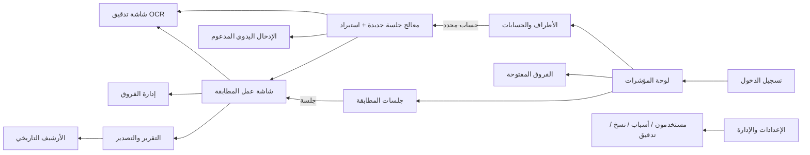

# 🎨 وثيقة تصميم الواجهات وتجربة الاستخدام — Stage 2c: UI/UX Design
## نظام مطابقة كشوفات الحسابات

> **الحالة:** مسودة بانتظار اعتماد مالك المشروع — **لا كود واجهات قبل الاعتماد**
> **التاريخ:** 2026-09-06
> **المصدر:** وثيقتا التحليل (Stage 1) والمعمارية (Stage 2) المعتمدتان + خريطة الشاشات §1.2
> **المنهجية:** لكل شاشة: الغرض والإجراء الأساسي ← بنية التخطيط ← المكونات ← تدفق التنقل ← الألوان/الخطوط ← السلوك المتجاوب

---

## 0. نظام التصميم (Design System) — الأساس المشترك لكل الشاشات

### 0.1 مبادئ التصميم الخمسة
1. **ثقة مالية أولاً:** الأرقام أهم شيء في النظام — خطوط أرقام ثابتة العرض، محاذاة صارمة، ولا تفاعل يخفي الأرقام.
2. **عربية أصيلة (RTL):** التصميم من اليمين لليسار منذ اليوم الأول — الشريط الجانبي يميناً، أيقونات "تقدّم/رجوع" معكوسة، لا "انعكاس لاحق".
3. **كثافة معلومات محاسبية:** المستخدمون 3–5 محاسبين يتعاملون مع جداول يومياً → جداول مدمجة (صف ~40px) لا لوحات تسويقية فارغة.
4. **صفر مفاجآت مالية:** كل ربط/إجراء مؤثر يعرض الأرقام المتأثرة قبل التنفيذ، وكل حالة لون لها معنى موثق لا يتغير.
5. **مسار واضح للأمام:** المعالجات (استيراد، تدقيق OCR) خطوات مرقّمة — المستخدم يعرف دائماً أين هو وما بقي.

### 0.2 لوحة الألوان (Hex)

> الروح العامة: أزرق عميق للثقة والاحترافية + أخضر/كهرماني/أحمر دلالات حالة مالية معتمدة عالمياً + بنفسجي/وردي لتمييز "بند عندنا فقط / عنده فقط".

| الاستخدام | اللون | Hex | ملاحظات |
|---|---|---|---|
| **الأساسي (الهوية)** | أزرق مؤسسي عميق | `#0F4C81` | أزرار رئيسية، روابط، ترويسة |
| الأساسي — تمرير | أزرق أغمق | `#0B3A63` | Hover/Active |
| الأساسي — خلفية فاتحة | أزرق باهت | `#E8F1F8` | خلفيات عناصر محددة، Active nav |
| **اللون المكمّل** | تيل (تركوازي) | `#0D9488` | عناصر ثانوية، شارات، مؤشرات إيجابية محايدة |
| **✅ مطابق تماماً** | أخضر | `#16A34A` | خلفية `#F0FDF4` / إطار `#BBF7D0` |
| **⚠️ فرق جزئي** | كهرماني | `#D97706` | خلفية `#FFFBEB` / إطار `#FDE68A` |
| **🟣 بند عندنا فقط** | بنفسجي | `#7C3AED` | خلفية `#F5F3FF` |
| **🌸 بند عنده فقط** | وردي | `#DB2777` | خلفية `#FDF2F8` |
| **❌ خطأ/منع** | أحمر | `#DC2626` | خلفية `#FEF2F2` |
| **ℹ️ معلومة** | أزرق فاتح | `#2563EB` | تنبيهات معلوماتية |
| **النص الأساسي** | رمادي داكن | `#0F172A` | |
| نص ثانوي | رمادي متوسط | `#475569` | تسميات، وصف |
| نص معطل | رمادي فاتح | `#94A3B8` | |
| حدود/فواصل | رمادي | `#E2E8F0` | |
| خلفية الصفحة | رمادي شديد الفتوح | `#F8FAFC` | والمحتوى أبيض `#FFFFFF` |

> **قاعدة ذهبية:** دلالات الألوان الأربعة (مطابق/جزئي/عندنا/عنده) **لا تُستخدم لأي غرض آخر** في أي شاشة — لكي يقرأ المحاسب الشاشة بلمحة.

### 0.3 الخطوط (Typography)

| العنصر | الاختيار | التفصيل |
|---|---|---|
| **الخط الأساسي** | **IBM Plex Sans Arabic** | عصري، نظيف، مصمم أصلاً للعربية، متاح مجاناً — يعمل Offline بعد تثبيته محلياً (شرط Q16: لا خطوط من Google Fonts عند التشغيل) |
| الخط الاحتياطي | Segoe UI، Tahoma | موجودة في كل Windows |
| **الأرقام المالية** | نفس الخط + خاصية `tnum` (أرقام جدولية ثابتة العرض) | الأعمدة المالية تتصفح عمودياً دون "اهتزاز" |
| شكل الأرقام | 0123456789 (لاتينية) افتراضياً | الأوضح في الأنظمة المحاسبية اليمنية؛ خيار تبديل للهندية (٠١٢٣) في الإعدادات |
| المقاسات | العرض 12 / النص 13–14 / العناوين الفرعية 16 / عناوين الصفحات 20 / الأرقام الكبيرة باللوحات 24–28 | كثافة مدمجة |

**عناصر ثابتة:** زوايا 8px، ظل خفيف للبطاقات، صفوف الجداول مخططة بخفة `#F8FAFC`، تركيز لوحة المفاتيح بإطار أزرق واضح 2px `#2563EB`.

### 0.4 ربط مباشر بـ Ant Design (لتوجيه المطور)

| Token في AntD | القيمة |
|---|---|
| `colorPrimary` | `#0F4C81` |
| `colorSuccess` / `colorWarning` / `colorError` / `colorInfo` | `#16A34A` / `#D97706` / `#DC2626` / `#2563EB` |
| `borderRadius` | `8` |
| `fontFamily` | `'IBM Plex Sans Arabic', 'Segoe UI', Tahoma` |
| `direction` | `rtl` (على مستوى `ConfigProvider` بالكامل) |
| مكوّن الجدول | كثافة `middle` أو `small` للشاشات المالية |

### 0.5 الهيكل العام (App Shell)

```
┌────────────────────────────────────────────────────────────────┐
│ الترويسة: [اسم النظام + شعار الشركة]   [بحث سريع]  [إشعارات🔔] [اسم المستخدم ▾] │
├───────────────┬────────────────────────────────────────────────┤
│ الشريط الجانبي │               منطقة المحتوى                    │
│ (يمين الشاشة) │                                                │
│ ▸ لوحة المؤشرات│                                                │
│ ▸ جلسات المطابقة│        (تتغير حسب الشاشة)                    │
│ ▸ الأطراف      │                                                │
│ ▸ الفروق       │                                                │
│ ▸ التقارير والأرشيف│                                            │
│ ▸ الإعدادات    │                                                │
└───────────────┴────────────────────────────────────────────────┘
```

### 0.6 خريطة التنقل العامة



---

## 1. شاشة تسجيل الدخول (Login)

### 1) الغرض والإجراء الأساسي
بوابة الدخول الآمنة للنظام. الإجراء الأساسي: إدخال اسم المستخدم وكلمة المرور والدخول. إجراء ثانوي: تغيير كلمة مرور مؤقتة (إجباري لأول دخول — FR-1.4).

### 2) بنية التخطيط
- شاشة كاملة بلا شريط جانبي، خلفية `#F8FAFC` مع لمسة زخرفية خفيفة (تدرج بأزرق `#0F4C81` شفاف).
- **بطاقة دخول مركزية** (عرض 400px): شعار الشركة، عنوان "نظام مطابقة كشوفات الحسابات"، حقل "اسم المستخدم"، حقل "كلمة المرور" (مع زر إظهار/إخفاء)، زر رئيسي "تسجيل الدخول" بعرض كامل.
- أسفل البطاقة: مبدّل لغة الواجهة (عربي/English) + رقم إصدار النظام.

### 3) المكونات الرئيسية
- حقول إدخال بتسميات فوق الحقل، تحقق فوري (حقل فارغ = إطار أحمر + رسالة).
- **رسالة خطأ عامة موحدة** عند فشل الدخول: "اسم المستخدم أو كلمة المرور غير صحيحة" (لا تكشف أيهما الخطأ — ممارسة أمان).
- **حالة القفل:** بعد 5 محاولات تظهر رسالة بعدّاد الوقت المتبقي "حُظر مؤقتاً — حاول بعد 4:32" (FR-1.5).
- شاشة فرعية "تغيير كلمة المرور الإلزامي": 3 حقول (الحالي/الجديد/تأكيد) + مؤشر قوة كلمة المرور + قواعد السياسة ظاهرة (طول، أحرف...).

### 4) تدفق التنقل
الوصول: الرابط المباشر للنظام على الشبكة الداخلية. بعد النجاح → **لوحة المؤشرات**. تغيير كلمة المرور الإلزامي → شاشة التغيير → لوحة المؤشرات. المستخدم المعطّل → رسالة "حسابك معطل — راجع مدير النظام".

### 5) الألوان والخطوط
وفق النظام الموحد (§0). زر الدخول بالأزرق الأساسي `#0F4C81`، بلا ألوان دلالية.

### 6) الاستجابة
حاسوب/تابلت: البطاقة مركزية كما هي. جوال: البطاقة بعرض الشاشة بهوامش 16px — النظام عموماً **قراءة فقط** على الجوال (انظر §12).

---

## 2. لوحة المؤشرات (Dashboard)

> المقابل في منهجية الأمر: "Admin Dashboard" — مكيَّفة على الاحتياج المالي.

### 1) الغرض والإجراء الأساسي
**شاشة "ماذا ينتظرني اليوم؟"** — نظرة 30 ثانية: أي جلسات متعثرة، كم فرقاً مفتوحاً وقيمته، من الموردين متأخر. الإجراء الأساسي: **الانتقال لجلسة تحتاج عملاً** (فتحها من الجدول).

### 2) بنية التخطيط
```
┌───────────────────────────────────────────────────────┐
│ [KPI: جلسات مفتوحة] [KPI: فروق مفتوحة + قيمتها]       │
│ [KPI: نسبة المطابقة هذا الشهر] [KPI: فروق متأخرة >30ي] │
├────────────────────────────┬──────────────────────────┤
│ جدول: جلسات تحتاج انتباهاً  │ رسم: تطور نسبة المطابقة  │
│ (طرف/فترة/حالة/أحدث نشاط)  │ (آخر 6 أشهر، حسب الطرف) │
├────────────────────────────┴──────────────────────────┤
│ جدول: الفروق الأقدم (متجاوزة 30 يوماً) — مرتبة تصاعدياً │
└───────────────────────────────────────────────────────┘
```

### 3) المكونات الرئيسية
- **4 بطاقات KPI**: رقم كبير (24–28px) + سطر مقارنة "عن الشهر السابق ↑/↓" + نقطة لون دلالي. النقر على البطاقة يفتح القائمة المرشّحة المقابلة.
- **جدول "جلسات تحتاج انتباهاً"**: أعمدة: الطرف، العملة، الفترة، الحالة (شارة ملونة)، الفروق المفتوحة (عدد/قيمة)، آخر نشاط. فلترة سريعة: [مدين لي / كلي]. النقر على صف → شاشة عمل المطابقة.
- **رسم شريطي بسيط** (مكتبة رسم داخلية، لا مكتبات خارجية تُحمَّل من الإنترنت): تطور نسبة المطابقة شهرياً.
- **إشعارات الزاوية 🔔:** عدد الفروق المعينة عليّ + الجلسات المفتوحة منذ >14 يوماً.

### 4) تدفق التنقل
الوصول: الشاشة الافتراضية بعد الدخول. الإجراءات: صف جلسة → شاشة المطابقة (§4)؛ بطاقة "فروق مفتوحة" → قائمة الفروق (§6)؛ بطاقة "جلسات" → قائمة الجلسات.

### 5) الألوان والخطوط
KPIs بالنيوترال مع نقاط لون دلالي فقط — لا بطاقات ملونة كاملة (تبقى الشاشة هادئة والألوان محفوظة لمعاني الحالات).

### 6) الاستجابة
تابلت: شبكة KPI تتحول 4→2×2، الجدولان يتراصان عمودياً. جوال: بطاقات KPI صفّية قابلة للتمرير أفقياً، والجداول تُعرض كبطاقات مختصرة (قراءة فقط).

---

## 3. الأطراف والحسابات (Partners & Accounts)

> المقابل في منهجية الأمر: "Patient Profile" — ملف الطرف هو "ملف المريض" في نظامنا.

### 1) الغرض والإجراء الأساسي
إدارة شجرة الموردين وحساباتهم بالعملات الثلاث، وما يخص كل حساب: قالب الاستيراد، خريطة المراجع، التسويات المبلَّغة. الإجراء الأساسي: **فتح ملف مورد** ثم فتح/إنشاء جلسة مطابقة له.

### 2) بنية التخطيط
**تخطيط رئيسي–تفصيلي (Master–Detail):** قائمة موردين يميناً (بحث + فلتر نشط/معطل + زر "مورد جديد")، ولوحة التفاصيل يساراً.
لوحة التفاصيل **تبويبات**:
1. **البيانات الأساسية** — الاسم، الرمز، التواصل، ملاحظات، حالة النشاط.
2. **الحسابات (3 عملات)** — بطاقة لكل عملة YER/USD/SAR: رقم الحساب في أونكس (`our_ledger_code`)، نافذة التاريخ، ترتيب القواعد، أرصدة آخر جلسة، زر "جلسة مطابقة جديدة".
3. **قوالب الاستيراد** — قائمة القوالب المحفوظة + "قالب جديد" + الافتراضي لكل صيغة.
4. **خريطة المراجع** — جدول (رقمنا ↔ رقمه، مصدر الإدخال، أُضيف متى) + استيراد/إضافة يدوية + اعتماد اقتراحات النظام المعلقة.
5. **التسويات المبلَّغة** — سجل (تاريخ/نوع/مبلغ/عملة/ملاحظة) + "تسوية جديدة".
6. **سجل المطابقات** — خط زمني للجلسات السابقة بنتائجها (نسبة مطابقة، فروق) — مختصر مع رابط للأرشيف.

### 3) المكونات الرئيسية
- جدول موردون: بحث فوري بالاسم/الرمز، شارة لكل عملة (YER كهرماني فاتح، USD أخضر فاتح، SAR أزرق فاتح — تُستخدم في كل النظام كعلامة عملة بصرية).
- نافذة منبثقة (Modal) "مورد جديد": 4 حقول فقط (الاسم عربي، الاسم إنجليزي اختياري، رمز، نوع=مورد) — الإضافة السريعة تشجع اكتمال البيانات.
- تبويب الحسابات: **شارات العملات** الثلاث دائماً ظاهرة معاً لتذكير قاعدة "حساب لكل عملة".
- تبويب خريطة المراجع: شارات المصدر (يدوي 🖊 / مؤكد ✓ / مقترح 💡) + زر "اعتماد المقترحات (n)".

### 4) تدفق التنقل
الوصول: الشريط الجانبي "الأطراف" أو النقر على اسم طرف من أي شاشة. الإجراءات: "جلسة مطابقة جديدة" → معالج الاستيراد (§4) مع تعبئة الطرف والعملة مسبقاً؛ تبويب سجل المطابقات → الأرشيف.

### 5) الألوان والخطوط
محايدة؛ شارات العملات الثلاث كالتالي: YER `#FEF3C7`/نص `#92400E`، USD `#DCFCE7`/نص `#166534`، SAR `#DBEAFE`/نص `#1E40AF` — **وهي ثابتة في كل شاشات النظام**.

### 6) الاستجابة
تابلت: القائمة والتفاصيل تتبدلان (عرض قائمة → عرض تفاصيل) بدل التقسيم. الجوال: قراءة فقط.

---

## 4. معالج جلسة جديدة واستيراد كشف (New Session & Import Wizard)

> المقابل في منهجية الأمر: "New Appointment Form" — أهم "نموذج إدخال" في نظامنا.

### 1) الغرض والإجراء الأساسي
إنشاء جلسة مطابقة: طرف + عملة + فترة، ثم استيراد الكشفين (جهتنا من أونكس، وجهة المورد) بجودة مضمونة قبل الاعتماد. الإجراء الأساسي: **إكمال خطوات المعالج الأربع والوصول لشاشة المطابقة**.

### 2) بنية التخطيط
**معالج خطوات (Stepper) أعلى الصفحة** — الخطوات: `1 إنشاء الجلسة ← 2 كشفنا ← 3 كشف المورد ← 4 تم`
الخطوة الحالية بعرض المحتوى الكامل؛ المكتملة بعلامة ✓ خضراء؛ المستقبلية معطلة.

### 3) المكونات الرئيسية (خطوة بخطوة)

**الخطوة 1 — إنشاء الجلسة:**
- اختيار الطرف (بحث ذكي)، العملة (3 أزرار شارات)، الفترة (شهر/سنة أو نطاق تاريخ).
- عرض **الرصيد الافتتاحي المرحَّل تلقائياً** من الجلسة السابقة (D9) في بطاقة صغيرة قابلة للتعديل + سبب أي تعديل.
- تحذير فوري إن وُجدت جلسة غير مغلقة لنفس الحساب/الفترة (409 منطقي) مع خيار "أكمل الجلسة القائمة".

**الخطوتان 2 و3 — رفع الكشفين (التصميم واحد للجهتين):**
- منطقة سحب وإفلات + زر "اختر ملفاً" + رابط صغير "إدخال يدوي / صورة ممسوحة" → تحويل إلى شاشة §5 أو §6.
- بعد الرفع: بطاقة الملف (الاسم، الحجم، بصمة، من رفع ومتى) + اختيار القالب (قوالب الحساب المحفوظة، افتراضي محدد مسبقاً).
- **شاشة معاينة داخل نفس الخطوة:** جدول البنود المستخرجة (تاريخ/بيان/مدين/دائن/مرجع) قابلة للتصحيح الخلوي، مع **لوحة صحة** جانبية: ✅ "267 بنداً — متوافق مع عدد سجلات الترويسة" أو ❌ قائمة أخطاء لكل صف (تاريخ غير مفهوم/قيمة غير رقمية/عدم تسلسل رصيد) — النقر على الخطأ يمرّر ويضيء الصف المعني.
- أسفلها: "حفظ كقالب" (إن عدّل ربط الأعمدة) + زر "اعتماد الكشف".

**الخطوة 4 — تم:** ملخص (الجلسة، الكشفان، عدد البنود، الفروق الافتتاحية المحمولة) + زر رئيسي "تشغيل المطابقة وفتح شاشة العمل".

### 4) تدفق التنقل
الوصول: من ملف الطرف أو "جلسات المطابقة ← جلسة جديدة". كل "اعتماد كشف" يبقى في المعالج؛ الخطوة 4 → **شاشة عمل المطابقة**. "إدخال يدوي/صورة" → §5/§6 ثم عودة للخطوة نفسها.

### 5) الألوان والخطوط
المعالج نفسه محايد؛ لوحة الصحة تستخدم الأخضر/الأحمر الدلاليين فقط عند وجود نتيجة.

### 6) الاستجابة
تابلت: المعالج كما هو، جدول المعاينة بتمرير أفقي مع تثبيت عمودي التاريخ والبيان. جوال: غير مدعوم (رسالة توجيه للتابلت/الحاسوب).

---

## 5. شاشة تدقيق OCR (OCR Audit)

### 1) الغرض والإجراء الأساسي
تحويل صورة/مسح ضوئي إلى بنود موثوقة **بمراجعة بشرية إلزامية** (قرار D5 + خطر R9: لا بند يُعتمد دون عين بشرية). الإجراء الأساسي: **مقارنة صف بصف بين الصورة والقيم المستخرجة وتصحيح/تأكيد كل صف**.

### 2) بنية التخطيط
**تقسيم عمودين 50/50** (في RTL: الصورة يميناً والجدول يساراً):
- يمين: عارض الصورة (تكبير/تصغير/تدوير/سحب) + شريط أدوات.
- يسار: جدول البنود المستخرجة (تاريخ/بيان/مدين/دائن) — كل صف له حالة: 🟡 مستخرج بانتظار المراجعة / ✅ مؤكد بشرياً / 🔴 به مشكلة.
- شريط علوي: نسبة الإنجاز "المؤكد 18/42" + زر "اعتماد الكشف" (معطل حتى تأكيد كل الصفوف) + زر "التحويل للإدخال اليدوي".

### 3) المكونات الرئيسية
- **المراجعة صف-بصف:** عند تأكيد/تصحيح صف، ينتقل التركيز تلقائياً للصف التالي (إيقاع عمل سريع بلا نقرات زائدة).
- **تمييز بالثقة:** خلايا منخفضة الثقة من الـ OCR خلفية كهرمانية `#FFFBEB`؛ النقر على الخلية يظهر تلميحاً بالنص المستخرج خاماً.
- عداد متزامن اختياري: خطوط إرشادية على الصورة تعين موضع الصف الحالي.
- حالة رداءة الجودة: تنبيه علوي "جودة الاستخراج منخفضة — يُنصح بالإدخال اليدوي" مع زر تحويل مباشر (مسار أ1 في UC-05).

### 4) تدفق التنقل
الوصول: من خطوة رفع الكشف عند اختيار ملف صورة/ممسوح، أو من داخل المعالج. الاعتماد → عودة لخطوة المعالج نفسها والكشف معتمد. "إدخال يدوي" → §6.

### 5) الألوان والخطوط
ألوان الحالة الثلاثة للصفوف (كهرماني/أخضر/أحمر) فقط — بقية الشاشة محايدة بامتياز لتقليل إجهاد العين أثناء المراجعة الطويلة.

### 6) الاستجابة
حاسوب: عمودان. تابلت (عرضي): عمودان مضغوطان؛ (طولي): تبديل بين "الصورة/الجدول" بزر — مع بقاء شريط الصف الحالي. جوال: غير مدعوم.

---

## 6. الإدخال اليدوي المدعوم (Assisted Manual Entry)

### 1) الغرض والإجراء الأساسي
إدخال كشف يدوياً بسرعة قصوى مع بقاء الصورة مرئية. الإجراء الأساسي: **كتابة البنود في شبكة سريعة**.

### 2) بنية التخطيط
مثل §5 (عمودان) لكن اليسار **شبكة إدخال فارغة قابلة للإضافة** بدل جدول مستخرج: صف = (تاريخ، بيان، مرجع، مدين، دائن) + زر "صف جديد" + إجمالي متجدد أسفلها (مدين/دائن/الفرق) للمقارنة مع صافي الصورة.

### 3) المكونات الرئيسية
- **لوحة مفاتيح أولاً:** Enter = صف جديد، Tab = الخلية التالية، لصق صف كامل من Excel (Ctrl+V ذكي يوزع الأعمدة).
- تحقق خلوي فوري (تاريخ/رقمية) بنفس لغة الأخطاء في §4.
- حفظ تلقائي كمسودة كل 10 ثوانٍ + مؤشر "حُفظ ✓".
- شريط الإجمالي المتجدد: "مدين 12,500 — دائن 12,500 — متوازن ✅" (توازن الكشف نفسه فحص مبكر قبل المطابقة).

### 4) تدفق التنقل
الوصول: من §4 أو §5. "حفظ واعتماد" → عودة لخطوة المعالج.

### 5) الألوان والخطوط
موحد؛ أخضر التوازن فقط عند اتزان الشبكة.

### 6) الاستجابة
مطابق لـ §5.

---

## 7. شاشة عمل المطابقة (Matching Workspace) ⭐ — قلب النظام

> المقابل في منهجية الأمر: "Appointment Calendar + Doctor Schedule" — شاشة العمل اليومية الرئيسية.

### 1) الغرض والإجراء الأساسي
مقارنة كشفي الجلسة جنباً إلى جنب، ومطابقتهما: قبول نتائج الآلي، وتصحيحه بالربط اليدوي، وتحويل ما لا يُحل إلى فروق. **الإجراء الأساسي: ربط/فك بنود حتى تُنفد قائمة غير المطابق القابلة للحل.**

### 2) بنية التخطيط
```
┌────────────────────────────────────────────────────────────────┐
│ شريط الجلسة: مورد X · YER · 2026-08 · [قيد العمل] · أزرار:     │
│ [إعادة تشغيل المطابقة] [إنشاء التقرير] [إغلاق الجلسة]          │
├──────────────────────────────┬─────────────────────────────────┤
│ شريط الملخص: مطابق 31        │ فروق مفتوحة 4 · نسبة 88.6%      │
├──────────────────────────────┴─────────────────────────────────┤
│ ← عرض "الروابط": كل ربط بطاقة (بنودنا ↔ بنوده، القاعدة، الثقة) │
├────────────────────────────────────────────────────────────────┤
│ جدولان جنباً إلى جنب:                                           │
│ [بنودنا: تاريخ|بيان|مرجع|مدين|دائن] ↔ [بنوده: نفس الأعمدة]      │
│ ألوان الصفوف = الحالات الأربع + حالة "مستهلك في ربط" باهتة      │
├────────────────────────────────────────────────────────────────┤
│ لوحة الاقتراحات (سفلية قابلة للطي): "دفعة 10,000 تغطي فاتورة 4468 تماماً — [اربط]" │
└────────────────────────────────────────────────────────────────┘
```

### 3) المكونات الرئيسية
- **نمطا عرض** يتبدلان بتبويب: "غير المطابق" (افتراضي — جدولان متقابلان) و"كل البنود" (جدول موحد بفلتر).
- **الربط اليدوي بنموذج "اختر ثم اربط":** تحديد صف أو أكثر من جدولنا (Ctrl/Shift) + صف أو أكثر من جدوله → زر "اربط (n↔m)" يظهر عائماً بين الجدولين → نافذة تأكيد تعرض مجموع كل جهة وفرق التوازن:
  - متوازن تماماً → زر "تأكيد الربط" أخضر.
  - غير متوازن → **زر معطل** + رسالة "الفرق: 500 — الربط يتطلب تطابقاً تاماً (Q11)" + اختصار "أنشئ فرقاً".
- **بطاقة ربط** (في عرض الروابط): بنود الجهتين، شارة القاعدة (`مرجع تام` / `خريطة` / `من البيان` / `مبلغ+تاريخ` / `يدوي`) + **درجة الثقة** (تلميح يشرح "لماذا طُوبق؟") + أزرار [تفاصيل] [فك الربط].
- فك الربط → تأكيد بنافذة صغيرة + سبب اختياري → البندان يعودان لقائمة غير المطابق.
- **لوحة الاقتراحات:** توزيع الدفعات تحت الحساب (FR-4.4) + اقتراحات خريطة مراجع جديدة ("احفظ: 7012↔INV-4471؟ [احفظ] [تجاهل]") + مطابقات مبلغ/تاريخ المحتملة غير المنفذة.
- **فلاتر:** نطاق تاريخ، مبلغ (من–إلى)، نص بيان، حالة، عملة ثابتة (معلَمة أعلى الشاشة).
- بحث بالنص الفوري في الجدولين معاً.
- عدادات حية على رؤوس الجداول: "غير مطابق: عندنا 6 · عنده 7".
- تنبيه علوي مُلزم عند وجود فروق "جديدة" عند محاولة الإغلاق (FR-5.6).

### 4) تدفق التنقل
الوصول: الخطوة 4 من المعالج، أو لوحة المؤشرات، أو قائمة الجلسات. الإجراءات: "أنشئ فرقاً" → شاشة الفروق مع تعبئة البند؛ "إنشاء التقرير" → §8 (متاح بعد إغلاق الجلسة، قبله "مسودة")؛ "إغلاق الجلسة" → تأكيد + شروط → قائمة الجلسات.

### 5) الألوان والخطوط
هنا تعمل **دلالات الألوان الأربعة المحجوزة** (§0.2): صف أخضر فاتح = مطابق، كهرماني = مطابق بفروق، بنفسجي = عندنا فقط، وردي = عنده فقط؛ المستهلك في ربط باهت 50%. صف التحويم بإطار أزرق `#2563EB`، والمحدد بخلفية `#E8F1F8`.

### 6) الاستجابة
**حاسوب فقط فعلياً** (الحد الأدنى 1280px؛ تجربة مقبولة حتى 1024px بعرض عمودين 50/50). تابلت: رسالة توجيه "شاشة المطابقة تتطلب حاسوباً" مع إتاحة **العرض فقط** (جدول موحد للنتائج بلا ربط). جوال: غير مدعوم.

---

## 8. إدارة الفروق (Discrepancies)

> المقابل في منهجية الأمر: "Billing/Invoices" — حيث "تُسوّى المطالب".

### 1) الغرض والإجراء الأساسي
متابعة كل فرق من اكتشافه حتى حله: سبب، مسؤول، مراسلات، حالة. الإجراء الأساسي: **فتح فرق وتحديث حالته**.

### 2) بنية التخطيط
- قائمة رئيسية بفلترة غنية (شريط فلاتر علوي) + جدول.
- **لوحة تفاصيل منزلقة (Drawer)** من اليسار عند النقر على فرق — تعرض التفاصيل كاملة دون مغادرة القائمة.

### 3) المكونات الرئيسية
**الفلاتر:** الطرف، العملة، الفترة، النوع (مبلغ/تاريخ/مرجع/عندنا/عنده)، السبب، المسؤول، الحالة، "متجاوز N يوماً". أزرار "حفظ الفلتر" للمشاهدات المتكررة.
**الجدول:** الطرف/الحساب، الفترة، الوصف المختصر، القيم (عندنا↔عنده والفرق)، السبب (شارة)، المسؤول (صورة رمزية أولية)، العمر بالأيام (تتدرج كهرمانياً بعد 14 و30)، الحالة.
**لوحة التفاصيل المنزلقة:** رأس بالقيم المقارنة كاملة + رابط "افتح في شاشة المطابقة"، ثم: اختيار سبب (قائمة رموز الأسباب FR-5.2)، ربط بتسوية مبلَّغة، تعيين مسؤول، **سجل تعليقات زمني** (مربع إدخال + سلسلة رسائل بتاريخ وكاتب)، وأزرار الحالة: [ابدأ المتابعة] [حل] [إغلاق كمقبول] — الحل يفرض كتابة ملاحظة حل (تحقق 422 من الواجهة والخادم).

### 4) تدفق التنقل
الوصول: الشريط الجانبي "الفروق" (القائمة الكاملة عبر الفترات)، أو بطاقة KPI من اللوحة، أو من شاشة المطابقة. الإجراءات: رابط "افتح في المطابقة" → §7 لجلسة الفرق. بعد "حل" → يظهر تأكيد خضراء Toast ويُحدّث الصف.

### 5) الألوان والخطوط
شارات الحالة: جديد أزرق `#DBEAFE`، قيد المتابعة كهرماني `#FEF3C7`، محلول أخضر `#DCFCE7`، مقبول رمادي `#E2E8F0`. العمر المتأخر يستخدم تدرج الكهرماني→الأحمر نصاً فقط (بلا خلفيات صارخة).

### 6) الاستجابة
تابلت: القائمة كاملة، الدرج بعرض كامل. جوال: قراءة القائمة والتفاصيل فقط (بلا تعديل).

---

## 9. التقارير والأرشيف (Reports & Archive)

### 1) الغرض والإجراء الأساسي
إصدار تقرير المطابقة الرسمي، تصديره (PDF للمورد/Excel للداخل)، وأرشفة كل الجلسات التاريخية قابلة للاستعراض. الإجراء الأساسي: **معاينة التقرير ثم تصديره**.

### 2) بنية التخطيط
**وضعان بتبويب:** "تقرير جلسة" و"أرشيف حساب".
- تقرير جلسة: **معاينة A4 حقيقية** (إطار ورقة أبيض بظل على خلفية `#F1F5F9`) على اليسار، ولوحة تحكم يمين: بيانات الترويسة (قابلة للتعديل قبل الإصدار)، تضمين/استبعاد أقسام (الملخص/التفصيل/الفروق/خطاب المطابقة)، أزرار [PDF] [Excel] [خطاب المطابقة].
- أرشيف حساب: **شجرة استعراض يمين**: مورد ← عملة ← سنوات ← شهور (مع أيقونة حالة كل جلسة)، ويسار: تفاصيل الجلسة المختارة + نتائجها + روابط تحميل تقريرها + **سجل الإصدارات** عند إعادة الفتح (v1, v2...).

### 3) المكونات الرئيسية
- المعاينة مطابقة 1:1 لمخرج PDF (نفس الترويسة: شعار الشركة، الطرف، العملة، الفترة — FR-6.1).
- حالة "مسودة" ظاهرة كعلامة مائية رمادية خلف المعاينة قبل إغلاق الجلسة (UC-04 هـ1).
- كل عملية تصدير تُسجل بالتدقيق تلقائياً (يظهر تلميحاً صغيراً "تُسجل عمليات التصدير في سجل التدقيق").
- تصفية أرشيف بالسنة سريعة + بحث باسم المورد.

### 4) تدفق التنقل
الوصول: من شاشة المطابقة بعد الإغلاق، أو الشريط الجانبي "التقارير والأرشيف"، أو من ملف الطرف (سجل المطابقات). التصدير → تنزيل بالمتصفح. "جلسة أخرى" → الشجرة.

### 5) الألوان والخطوط
الورقة بيضاء بخط التقرير الرسمي؛ واجهة التحكم بالنظام الموحد. أزرار التصدير: PDF أساسي أزرق، Excel ثانوي محدد.

### 6) الاستجابة
تابلت: المعاينة فوق لوحة التحكم (تبديل). جوال: عرض الأرشيف والتنزيل فقط (بلا توليد تقارير جديدة).

---

## 10. الإعدادات والإدارة (Settings & Admin)

> المقابل في منهجية الأمر: "Settings".

### 1) الغرض والإجراء الأساسي
إدارة كل ما يحيط بالعمل: المستخدمون والصلاحيات، رموز الأسباب، بيانات الشركة والعملات، النسخ الاحتياطي، وسجل التدقيق. الإجراء الأساسي: إدارة المستخدمين.

### 2) بنية التخطيط
تبويبات أفقية أعلى الصفحة: `المستخدمون | رموز الأسباب | بيانات الشركة والعملات | النسخ الاحتياطي | سجل التدقيق` — محتوى تحت التبويب مباشرة (بلا قوائم فرعية).

### 3) المكونات الرئيسية
- **المستخدمون:** جدول (اسم، مستخدم، دور كشارة، نشط، آخر دخول) + نافذة "مستخدم جديد" (اختيار الدور بثلاث بطاقات راديو تشرح كل دور بسطر) + إجراءات صف: تعديل/تعطيل (بتأكيد) + "إجبار تغيير كلمة المرور".
- **رموز الأسباب:** قائمة قابلة لإعادة الترتيب (سحب) + إضافة/تعطيل — الاسم عربي/إنجليزي (يظهر بالتقرير حسب لغته).
- **بيانات الشركة والعملات:** نموذج (الاسم، الشعار بالرفع، العنوان، الترويسة للتقارير) + عملات النظام الثلاث للعرض/الترتيب + خيار شكل الأرقام (لاتينية/هندية).
- **النسخ الاحتياطي:** حالة آخر نسخة (وقتها وحجمها ومكانها) + زر "نسخة الآن" + جدول النسخ + زر "استرجاع نسخة" بمسار موجه تحذيري بحافز مزدوج (أحمر، يتطلب كتابة كلمة "استرجاع").
- **سجل التدقيق:** جدول قراءة فقط (من/متى/الفعل/الكيان/قبل-بعد) + فلاتر (مستخدم/فعل/فترة/كيان) + تصدير Excel — بلا أي زر تعديل أو حذف إطلاقاً (FR-7.2).

### 4) تدفق التنقل
الوصول: الشريط الجانبي "الإعدادات" — **ظاهرة للجميع لكن محتواها الإداري محمي بالدور** (المطالِع يرى رسالة صلاحيات). كل إجراء يبقى في تبويبه مع تأكيدات Toast.

### 5) الألوان والخطوط
موحد. منطقة الاسترجاع هي الوحيدة ذات الإطار الأحمر الدائم (منطقة خطر).

### 6) الاستجابة
تابلت: كامل الوظائف. جوال: قراءة فقط.

---

## 11. جدول الاستجابة الشامل (Responsive Summary)

| الشاشة | حاسوب ≥1280 | تابلت 768–1279 | جوال <768 |
|---|---|---|---|
| تسجيل الدخول | ✅ كاملة | ✅ كاملة | ✅ كاملة |
| لوحة المؤشرات | ✅ | ✅ (شبكة 2×2) | 👁 قراءة (بطاقات) |
| الأطراف | ✅ رئيسي–تفصيلي | ✅ تبديل قائمة/تفاصيل | 👁 قراءة |
| معالج الاستيراد | ✅ | ✅ (تمرير أفقي للمعاينة) | ❌ |
| تدقيق OCR | ✅ عمودان | ✅ عمودان/تبديل | ❌ |
| الإدخال اليدوي | ✅ | ✅ | ❌ |
| **شاشة المطابقة** | ✅ كاملة | 👁 عرض فقط (رسالة توجيه) | ❌ |
| الفروق | ✅ | ✅ | 👁 قراءة |
| التقارير والأرشيف | ✅ | ✅ (معاينة فوق التحكم) | 👁 تنزيل فقط |
| الإعدادات | ✅ | ✅ | 👁 قراءة |

> **الفلسفة:** الشاشات الثقيلة (مطابقة/استيراد) حاسوبية لأن مستخدميها الفعليين على مكاتبهم (Q1)، والجوال يخدم "الاطمئنان السريع" فقط.

---

## 12. إرشادات الحالات الموحدة (Empty / Loading / Error)

| الحالة | القاعدة |
|---|---|
| **فراغ** | كل جدول فارغ يعرض: أيقونة هادئة + جملة تشرح + **زر الإجراء الأول مباشرة** ("لا جلسات بعد — [أنشئ أول جلسة]") |
| **تحميل** | هياكل هياكل (Skeleton) للجداول، ودوران داخل الأزرار للإجراءات — لا شاشات "انتظر" صامتة؛ مطابقة كشف 500 بند تعرض "جارٍ المطابقة..." بخط حي |
| **خطأ** | رسائل بلغة المستخدم (نص `messageAr` من API الموحد) + إجراء تصحيح مقترح ("أعد المحاولة" / "راجع الصف 14") + رقم مرجعي تقني صغير `traceId` للدعم |
| **نجاح** | Toast خضراء أعلى اليسار (في RTL) 3 ثوانٍ للإجراءات غير الجدية؛ نافذة تأكيد للأفعال المؤثرة (إغلاق جلسة، استرجاع نسخة، فك ربط) |

**الوصولية (مختصر):** تباين نص/خلفية ≥ 4.5:1 في كل الحالات؛ كل إجراء يعمل بلوحة المفاتيح؛ تسميات ARIA للجداول المالية؛ لا يُنقل أي معنى باللون وحده (دائماً لون + أيقونة/نص).

---

## 13. قائمة تسليم للمطور (Handoff Checklist)

- [x] نظام ألوان برموز Hex كاملة + دلالات محجوزة للحالات
- [x] خط أساسي + مقاسات + قواعد أرقام جدولية
- [x] ربط مباشر بـ AntD Tokens + RTL عبر ConfigProvider
- [x] خريطة تنقل وهيكل App Shell
- [x] 10 شاشات: غرض/تخطيط/مكونات/تنقل/استجابة
- [x] قواعد الحالات الموحدة والوصولية
- [ ] النماذج التفاعلية (Mockups) عالية الدقة — الخطوة التالية المقترحة إذا رغبت
- [ ] مكتبة مكونات داخلية موحدة (MoneyCell, CurrencyBadge, StatusTag...) — تُبنى في المرحلة 0–1 من التنفيذ

---

## 14. الخطوة التالية بعد اعتماد هذه الوثيقة

1. اعتمادك للتصميم (أو تعديلاتك على أي شاشة)
2. *(اختياري)* بناء نموذج تفاعلي واحد للشاشة الأهم — شاشة عمل المطابقة — لتريها حية قبل بناء بقية النظام
3. بدء **Stage 3 — التنفيذ** بدءاً من المرحلة 0 وفق خطة المعمارية المعتمدة
